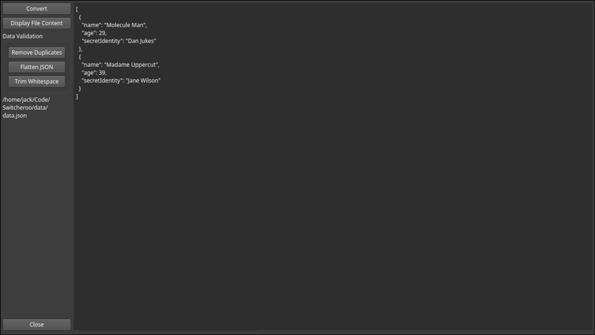

> [!WARNING]
> This is an experimental project. It it **not** intended for real, or critical use.

# Switcheroo

A small GUI file converter for converting between CSV and JSON with data validation utilities.



## Features

- Convert CSV to JSON and JSON to CSV
- Display file contents
- Remove duplicate records from CSV files
- Trim whitespace from CSV fields
- Flatten nested JSON structures

## Requirements

- CMake 4.2+
- C++23 compatible compiler
- Qt6

## Setup

Clone jsoncons into the external folder:

```bash
mkdir external
git clone https://github.com/danielaparker/jsoncons.git external/jsoncons
```

## Build and Run

```bash
cmake -B build && cmake --build build
./build/switcheroo
```

On macOS, install dependencies via Homebrew first:

```bash
brew install cmake qt6
```

## Platform Support

| Platform | Supported |
| -------- | --------- |
| Linux    | Yes       |
| macOS    | Yes       |
| Windows  | No        |
