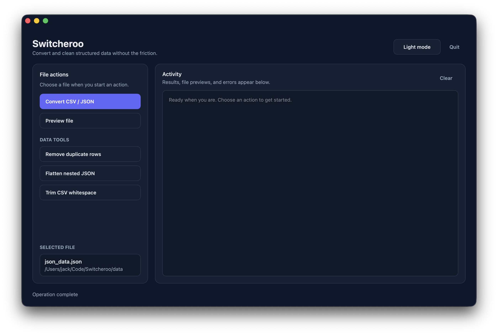

> [!WARNING]
> This is an experimental project. It is **not** intended for critical or production use.

# Switcheroo

Switcheroo is a small desktop application for converting between CSV and JSON and performing common data-cleanup operations.



## Features

- Convert CSV to JSON and JSON to CSV
- Preview CSV and pretty-printed JSON files
- Remove duplicate CSV records
- Trim whitespace from CSV fields
- Flatten complete JSON documents, including nested objects and arrays
- Convert flattened JSON records back into correctly structured CSV rows
- Persistent dark and light themes, with dark mode as the default
- Native macOS title-bar styling and file picker

> [!NOTE]
> Validation tools modify the selected file in place. Keep a backup if you need to retain the original file.

## Requirements

- CMake 4.2 or newer
- A C++23-compatible compiler
- Qt 6 with the Widgets component
- Git, for downloading `jsoncons`
- `jsoncons` headers under `external/jsoncons`

### macOS

- macOS 11 or newer
- Xcode Command Line Tools
- AppKit and Uniform Type Identifiers frameworks, included with macOS

Install the command-line tools and build dependencies with:

```bash
xcode-select --install
brew install cmake qt6
```

### Linux

Install a C++23 compiler, CMake 4.2+, and the Qt 6 Widgets development package using your distribution's package manager. Package names vary by distribution; the Qt package is commonly named `qt6-base-dev`.

## Setup

Clone the repository and initialize the header-only `jsoncons` dependency:

```bash
git clone <repository-url> Switcheroo
cd Switcheroo
mkdir -p external
git clone https://github.com/danielaparker/jsoncons.git external/jsoncons
```

The expected dependency layout is:

```text
external/jsoncons/include/jsoncons/
```

## Build

Configure and build the application from the repository root:

```bash
cmake -S . -B build
cmake --build build --parallel
```

If CMake cannot locate Homebrew's Qt installation on macOS, configure with:

```bash
cmake -S . -B build -DCMAKE_PREFIX_PATH="$(brew --prefix qt)"
cmake --build build --parallel
```

## Run

```bash
./build/switcheroo
```

Converted files are written beside the selected input file using the corresponding `.csv` or `.json` extension.

## Platform Support

| Platform | Supported | Notes |
| -------- | --------- | ----- |
| Linux | Yes | Uses the Qt file picker and standard window chrome |
| macOS | Yes | Uses native Finder-style file selection and title-bar integration |
| Windows | No | Not currently tested or supported |
